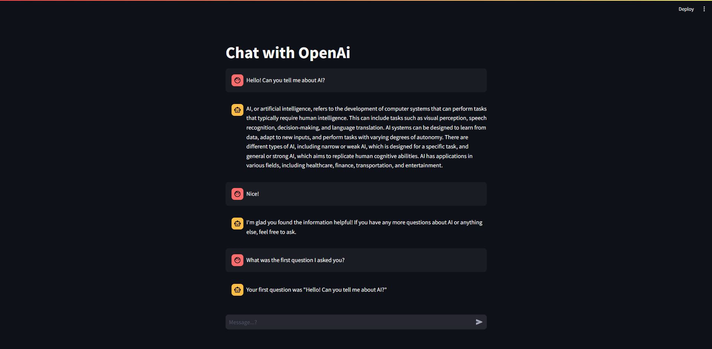

# Conversational Chatbot

This is a simple conversational chatbot with memory, built using langchain, OpenAI, FastAPI, and Streamlit.

---

If you'd like to explore the web app, feel free to check out its demo on my [Hugging Face Spaces](https://huggingface.co/spaces/idalz/conversational-chatbot) page.

---
## Streamlit App


---
## Setup

### 1. Create and activate a conda environment:
```bash
conda create -n <environment_name> python=3.8 -y
```
```bash
conda activate <environment_name> 
```

### 2. Install requirements:
```bash
pip install -r requirements.txt
```

### 3. Set up environment variables
Create a `.env` file and add your `OPENAI_API_KEY`.

---
## How to run

### 1. Start the server
In a terminal use this command:
```bash 
python server.py
```
### 2. Launch the client:
In another terminal use this command:
```bash
streamlit run client.py
```

Now you are ready to start a conversation!
